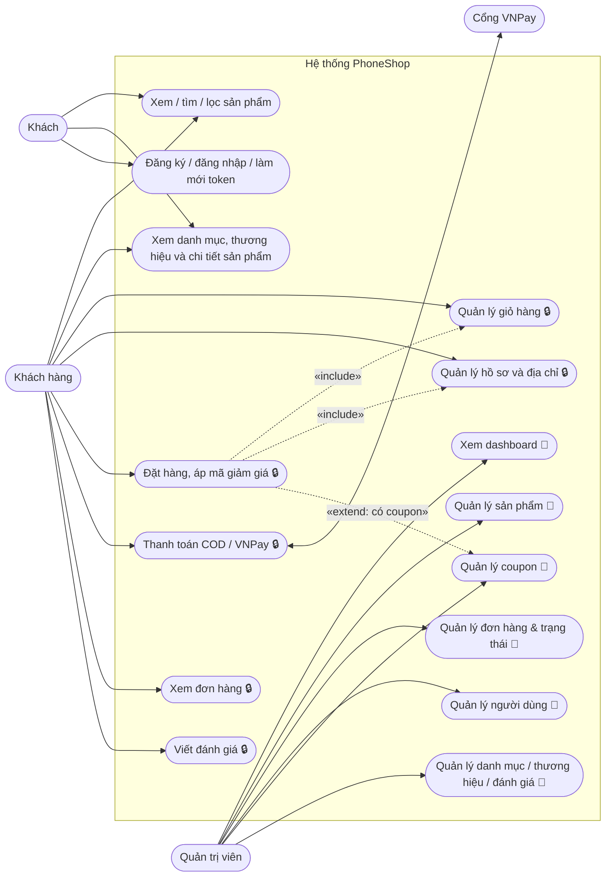
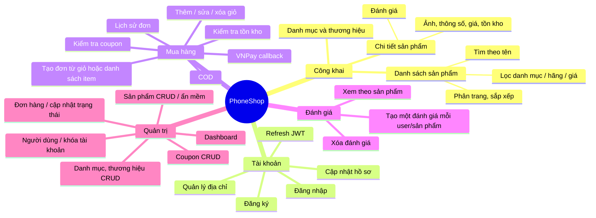
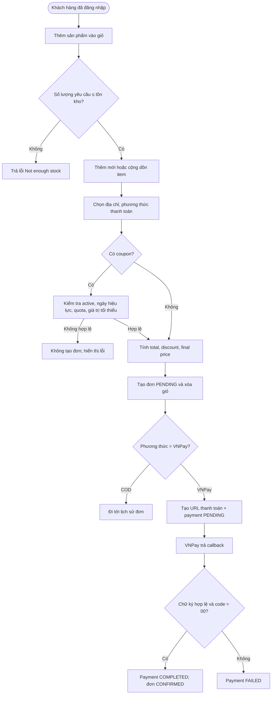
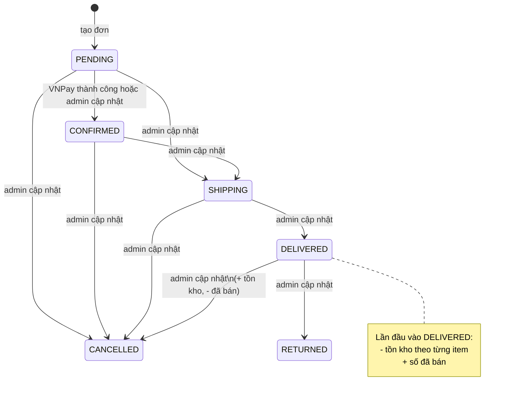
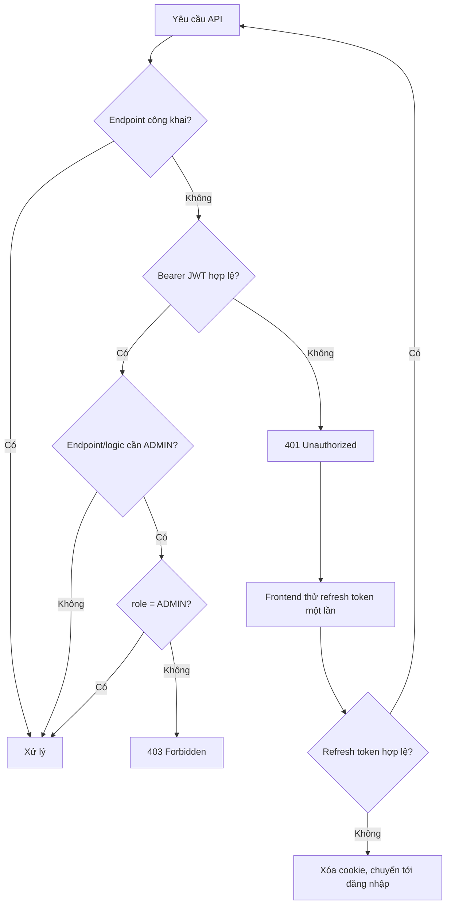

# Phân tích chức năng phục vụ viết test case – PhoneShop

## 1. Phạm vi đã đối chiếu

Tài liệu này được rút ra từ frontend Next.js, backend Spring Boot, cấu hình bảo mật và schema MySQL. Hệ thống có ba tác nhân chính: **khách**, **khách hàng đã đăng nhập** và **quản trị viên**; VNPay là tác nhân ngoài hệ thống.

> Quy ước: các use case có biểu tượng 🔒 yêu cầu JWT; 👑 chỉ dành cho ADMIN. Những API GET sản phẩm/danh mục/thương hiệu/đánh giá và callback VNPay là công khai.

## 2. Sơ đồ use case tổng quát

## 3. Sơ đồ phân rã chức năng để lập test suite

## 4. Luồng nghiệp vụ cần test

### 4.1 Mua hàng và thanh toán

### 4.2 Vòng đời đơn hàng và tồn kho

### 4.3 Phân quyền và xác thực

## 5. Danh mục test condition (dùng làm khung test case)

| Nhóm | Chức năng / điều kiện cần phủ | Kỹ thuật test nên dùng |
|---|---|---|
| AUTH | Đăng ký: thiếu trường, email sai/trùng, mật khẩu < 6, thành công tạo user + cart + token; đăng nhập sai, tài khoản khóa; refresh token hợp lệ/sai/hết hạn | Equivalence partition, boundary, security |
| PRODUCT | Tìm kiếm, lọc từng điều kiện/kết hợp, giá min–max, phân trang/sắp xếp, slug/id không tồn tại; tạo/sửa/xóa mềm, slug trùng, giá/stock âm, category/brand không tồn tại | Decision table, boundary, CRUD |
| CART | Giỏ rỗng/tự tạo; thêm mới/cộng item; số lượng 0/âm/null; vượt tồn; sửa về 0 (xóa); thao tác item của user khác | State transition, authorization, boundary |
| ADDRESS & PROFILE | Bắt buộc tên/sđt/tỉnh/huyện/xã; tạo/sửa/xóa; đặt địa chỉ mặc định chuyển cờ địa chỉ cũ; chỉ cho phép dữ liệu của chính user | CRUD, authorization |
| COUPON | Mã không tồn tại/tắt/chưa tới ngày/hết hạn/hết lượt/dưới đơn tối thiểu; PERCENT và FIXED; finalPrice không âm; tăng usedCount đúng một lần | Decision table, boundary |
| ORDER | Giỏ trống; địa chỉ không tồn tại/không thuộc user; item request và item từ giỏ; stock thiếu; tổng tiền lấy salePrice; xóa giỏ sau khi tạo; lịch sử/phân trang | End-to-end, transaction |
| PAYMENT | Chỉ chủ đơn được tạo URL; tạo payment lần đầu; callback chữ ký đúng/sai, response 00/khác 00, txnRef lỗi | Integration, negative/security |
| REVIEW | rating 1–5 và ngoài biên; thiếu product; chỉ một review/user/product; cập nhật avgRating khi tạo/xóa; quyền xóa admin | Boundary, authorization |
| ADMIN | USER/khách không truy cập API admin; dashboard; khóa/mở user; CRUD coupon; CRUD product; các trạng thái đơn, đặc biệt DELIVERED và CANCELLED | RBAC, state transition |

## 6. Ma trận trạng thái/expected result quan trọng

| TC group | Tiền điều kiện | Thao tác | Kết quả mong đợi |
|---|---|---|---|
| ORD-STOCK-01 | Đơn chưa DELIVERED, stock đủ | Chuyển sang DELIVERED | stock giảm đúng quantity; sold tăng đúng quantity |
| ORD-STOCK-02 | Đơn đã DELIVERED | Chuyển sang CANCELLED | stock hoàn lại; sold giảm nhưng không âm |
| ORD-STOCK-03 | Stock < quantity | Chuyển sang DELIVERED | Báo lỗi; không đổi đơn, stock, sold |
| CP-01 | Coupon % hợp lệ, total đạt min | Tạo đơn | discount = total × value / 100; usedCount +1 |
| CP-02 | Coupon FIXED > total | Tạo đơn | finalPrice = 0, không âm |
| CART-OWN-01 | Item thuộc user A | User B sửa/xóa | Lỗi; giỏ A không đổi |
| PAY-01 | VNPay trả đúng chữ ký + `00` | Gọi callback | payment COMPLETED, transactionId/paidAt được ghi, order CONFIRMED |

## 7. Điểm cần ưu tiên kiểm thử (rủi ro phát hiện từ mã nguồn)

1. **Kiểm tra quyền sở hữu bị thiếu ở một số API:** `PUT/DELETE /addresses/{id}` chỉ tìm theo `id`, và `GET /orders/{id}` cũng không đối chiếu user hiện tại. Đây là test bảo mật P1: user A không được đọc/sửa/xóa tài nguyên user B.
2. **Sửa số lượng giỏ không kiểm tra tồn kho:** `PUT /cart/items/{itemId}` không so sánh `quantity` với stock. Cần test số lượng vượt kho và xác nhận hệ thống phải chặn ngay hoặc tối thiểu chặn ở bước tạo đơn.
3. **Sản phẩm bị xóa mềm vẫn cần kiểm chứng khi hiển thị:** `DELETE /products/{id}` chỉ đặt `isActive=false`; truy vấn danh sách nên được test để bảo đảm sản phẩm ẩn không xuất hiện nếu đó là yêu cầu nghiệp vụ.
4. **Chuyển trạng thái đơn chưa ràng buộc thứ tự:** API nhận mọi enum status. Test các chuyển trạng thái bất hợp lệ theo quy trình mong muốn (ví dụ CANCELLED → SHIPPING, RETURNED → DELIVERED) để quyết định/ghi nhận yêu cầu.
5. **Đơn hàng không kiểm tra ownership của address:** cần test user A tạo đơn bằng `addressId` của user B. Đây là test phân quyền P1.
6. **Coupon validate ở checkout chưa kiểm `startDate` và `minOrder`;** tạo đơn có kiểm. Cần test tính nhất quán UX/API giữa bước áp mã và bước đặt đơn.

## 8. Gợi ý cấu trúc bộ test case

Tạo các sheet hoặc test suite theo mã: `AUTH`, `CATALOG`, `CART`, `PROFILE_ADDRESS`, `COUPON`, `ORDER`, `PAYMENT`, `REVIEW`, `ADMIN_RBAC`. Mỗi test case nên có: ID, module/use case, priority, precondition, test data, steps, expected result, actual result, status và bug ID.

